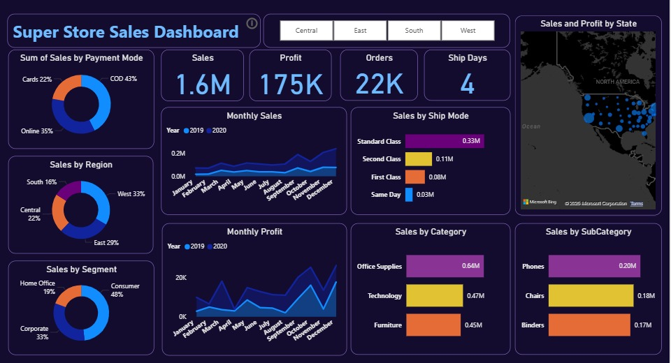
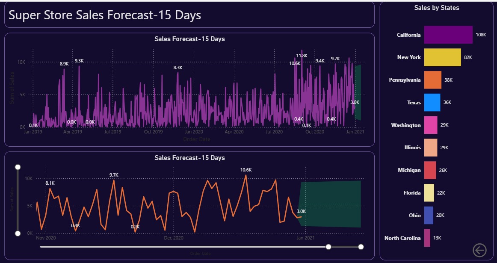

# POWER-BI-Dashboard

# 📊 Power BI Dashboard


---

## 🚀 Project Overview

This repository contains an **interactive Power BI dashboard** designed to analyze and visualize key business data.  
It allows us with actionable insights through intuitive visualizations and KPIs.

The dashboard enables users to:  

- Track performance metrics at a glance  
- Analyze trends and patterns in data  
- Drill down into detailed reports  
- Make data-driven decisions faster  

---

## 📂 Repository Structure
POWER-BI-Dashboard/
│── Dashboard.pbix # Power BI dashboard file
│── README.md # Project documentation
│── /images # Dashboard screenshots 


---

## 🖼️ Dashboard Preview

### 📌 Overview Page


### 📌 Sales Forecast


---

## ⚙️ Installation & Usage

1. **Clone this repository**  
   ```bash
   git clone https://github.com/Mehak-Garg18/POWER-BI-Dashboard.git

   ## ⚙️ Installation & Usage  

1. **Open the file**  
   - Download [Power BI Desktop](https://powerbi.microsoft.com/desktop/).  
   - Open `Dashboard.pbix` in Power BI Desktop.  

2. **Explore the dashboard**  
   - Navigate through different report pages.  
   - Apply filters & slicers to interact with data.  

---

## ✨ Features  

✔️ Interactive visualizations with drill-downs  
✔️ KPI tracking for quick insights  
✔️ Dynamic filtering and slicing  
✔️ Professional and clean dashboard layout  
✔️ Business-driven insights for decision-making  

---

## 📊 Data Source  

The dashboard uses **sample sales data** that includes:  
- Customer information  
- Products and categories  
- Regional sales performance  
- Revenue and profit trends  

---

## 🔮 Future Enhancements  

- [ ] Add automated data refresh using Power BI Service  
- [ ] Publish as a web app (Power BI Online)  
- [ ] Integrate with real-time data sources  


